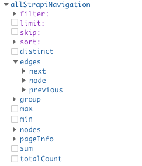

# gatsby-source-strapi-plugin-navigation-v2

This plugin sources the [strapi-plugin-navigation](https://github.com/VirtusLab-Open-Source/strapi-plugin-navigation).

## Install

yarn:
```bash
yarn add gatsby-source-strapi-plugin-navigation-v2
```
npm:
```bash
npm install gatsby-source-strapi-plugin-navigation-v2
```

## How to use
```js
// gatsby-config.js
module.exports = {
  plugins: [
    {
      resolve: "gatsby-source-strapi-plugin-navigation-v2",
      options: {
        apiURL: "localhost:1337",
        navigationIdsOrSlugs: [
          "api/navigation/render/1"
        ],
        type: "tree", // optional
        token: "strapi_token" // optional
      }
    }
  ]
}
```

If everything works correctly you should be able to view an `allStrapiNavigation` option inside GraphiQL.



## Credits
Heavily inspired by [edardev's](https://github.com/edardev/gatsby-source-strapi-plugin-navigation) sourcing plugin.
